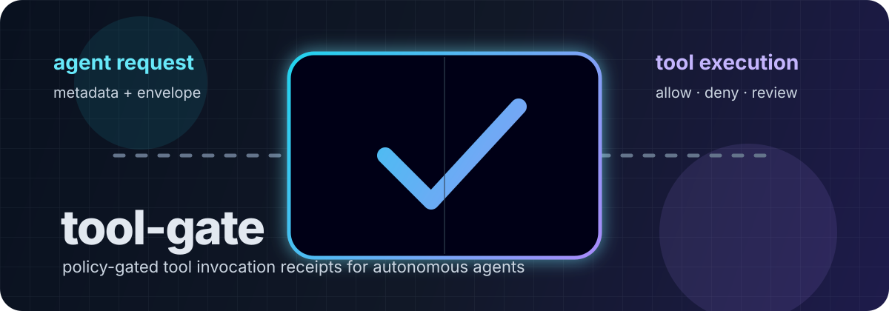
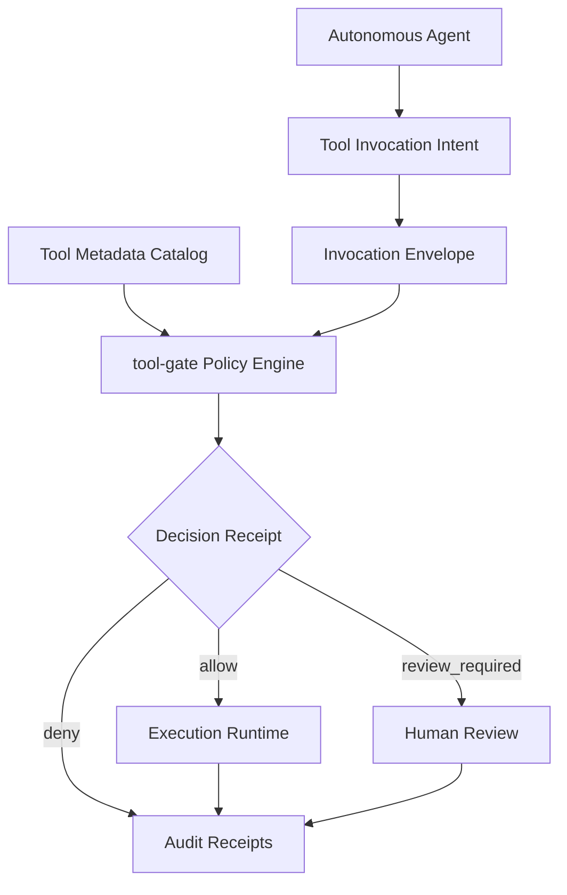

# tool-gate



`tool-gate` is a small Rust library and CLI for deciding whether an autonomous
agent should run a tool invocation. It does not execute tools. It accepts
caller-supplied JSON metadata, evaluates explicit policy rules, and emits a
machine-readable decision receipt: `allow`, `deny`, or `review_required`.

The crate is intentionally data-source agnostic. Tool catalogs, queues, agent
frameworks, storage layers, and LLM providers all remain outside the core. Bring
your own adapter, pass in a `ToolMetadata` plus an `InvocationEnvelope`, and use
the receipt to gate execution in your application.

## Vision

`tool-gate` is the ARDA safety boundary between an agent's proposed action and a
runtime's permission to execute it. It makes tool decisions deterministic,
auditable, and portable: every invocation is reduced to explicit metadata,
policy checks, and a machine-readable receipt before side effects happen.

## ARDA Architecture Role



## Why use it?

Autonomous systems often need a simple boundary between "the agent wants to do
something" and "the system is allowed to do it." `tool-gate` gives that boundary
an auditable shape:

- explicit risk levels for tools;
- target-scope checks before execution;
- trace requirements for mutating or reviewable actions;
- idempotency checks for state-changing tools;
- deterministic JSON receipts that are easy to log, test, or review.

## Install

```bash
git clone <your-fork-or-repo-url> tool-gate
cd tool-gate
cargo build --release
```

Run from source during development:

```bash
cargo run -- check examples/readonly-tool.metadata.json examples/readonly-tool.invocation.json
```

## CLI

```bash
tool-gate check <tool-metadata.json> <invocation-envelope.json>
tool-gate schema tool-metadata
tool-gate schema invocation-envelope
tool-gate schema decision-receipt
```

Exit codes:

| Code | Meaning |
| ---: | --- |
| `0` | Invocation is allowed. |
| `2` | Invocation is valid, but human review is required. |
| `3` | Invocation is denied by policy. |
| `64` | CLI usage error. |
| `65` | Invalid input JSON or schema mismatch. |
| `70` | Internal error. |

## Example output

```json
{
  "schema_version": "tool-gate.decision.v1",
  "decision": "allow",
  "reason": "invocation passed policy checks",
  "risk_level": "low",
  "requires_review": false,
  "trace_id": "trace-readonly-001",
  "policy_checks": [
    {
      "check_id": "input_valid",
      "status": "pass",
      "message": "metadata and invocation are structurally valid"
    },
    {
      "check_id": "target_allowed",
      "status": "pass",
      "message": "target matches allowed scope"
    }
  ]
}
```

## Library usage

```rust
use tool_gate::{evaluate_invocation, GatePolicy, InvocationEnvelope, ToolMetadata};

let metadata: ToolMetadata = serde_json::from_str(metadata_json)?;
let invocation: InvocationEnvelope = serde_json::from_str(invocation_json)?;
let receipt = evaluate_invocation(&metadata, &invocation, &GatePolicy::default());

println!("{}", serde_json::to_string_pretty(&receipt)?);
```

## Policy model

The default policy is conservative for actions that can change state:

1. validate the metadata and invocation envelope;
2. check that the invocation target matches the tool's allowed target patterns;
3. require trace evidence for mutating or reviewable actions;
4. require mutating tools to be declared idempotent;
5. require review for explicitly reviewable or critical-risk tools.

`tool-gate` is deliberately not a sandbox. It is a deterministic pre-execution
policy gate that should be paired with your own authentication, authorization,
sandboxing, and execution runtime.

## Examples

The `examples/` directory includes:

- `readonly-tool.metadata.json` and `readonly-tool.invocation.json` for an
  allowed read-only action;
- `mutating-idempotent.metadata.json` and
  `missing-trace-denied.invocation.json` for a denied mutating action.

## Development

```bash
cargo fmt --check
cargo clippy --all-targets -- -D warnings
cargo test
cargo doc --no-deps
```

## License

Licensed under either of Apache License, Version 2.0 or MIT license at your
option.
